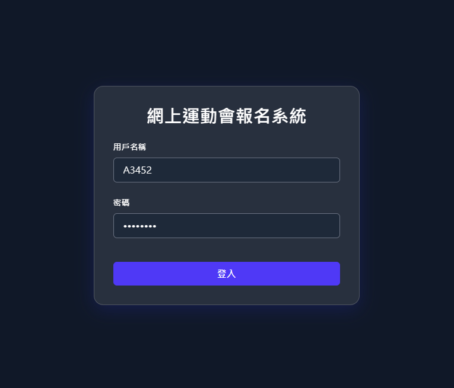
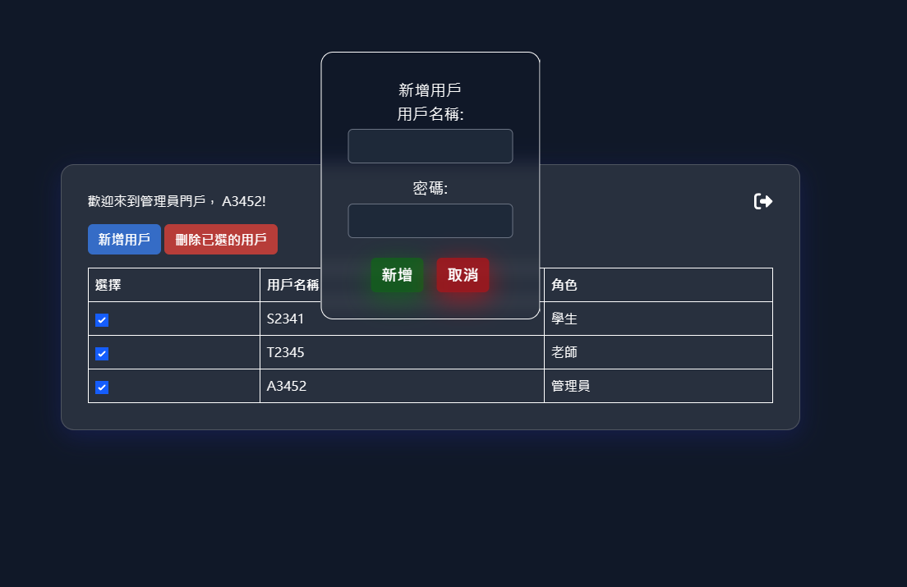

# Sports Day Enrollment SBA Project

## Overview

This project is a website for students and teachers to enroll and manage. Students can enroll in events to participate and teachers can manage the enrollments, they can also export the data to `.csv` files to use in Microsoft Excel or Access. The enrollment page's login system is secured using JWT authentication.

This is my first major project made using Svelte and TailwindCSS with around 3 months of learning. 

> [!NOTE] 
> Static page hosting is not supported due to CORS policy violation.

---

## Requirements

- Node.js
- npm

---

## Setup

> [!NOTE] 
> Before running the project, rename `demo.hash` to `credentials.hash`.

1. **Install dependencies:**

    ```
    npm i
    ```

2. **Start the development server:**

    ```
    npm run dev
    ```

    After running the command, Vite will display something like this:

    ```
    VITE v7.1.3  ready in XXXX ms

    ➜  Local:   http://localhost:5173/
    ```

3. **Open your browser:**  
   Go to [http://localhost:5173/](http://localhost:5173/) to access the login page.

---

## Demo Accounts

Use these demo accounts to log in (you can change them later):

| Role    | Username | Password   |
|---------|----------|------------|
| Student | S2341    | UzIzNDE=   |
| Teacher | T2345    | VDIzNDU=   |
| Admin   | A3452    | QTM0NTI=   |

---

## Features

- Student and teacher login
- Secure authentication with JWT
- Enrollment forms for students
- CSV export for teachers
- Admin panel for account management

---

## Project Structure

```
├── src/
│   ├── app.css         # Global CSS styles
│   ├── app.d.ts        # TypeScript global declarations
│   ├── app.html
│   ├── hooks.server.ts # SvelteKit server hooks
│   ├── lib/            # Useful components and utilities
│   │   ├── auth.ts
│   │   ├── credentials.server.ts
│   │   ├── index.ts
│   │   ├── LogoutButton.svelte
│   │   └── assets/
│   │       └── favicon.svg
│   ├── routes/         # SvelteKit route handlers and pages
│   │   ├── +layout.svelte
│   │   ├── +layout.ts
│   │   ├── +page.svelte
│   │   ├── admin/
│   │   │   ├── +page.server.ts
│   │   │   └── +page.svelte
│   │   ├── api/
│   │   │   └── auth/
│   │   │       └── +server.ts
│   │   ├── enrollment/
│   │   │   ├── +page.server.ts
│   │   │   └── +page.svelte
│   │   └── management/
│   │       ├── +page.server.ts
│   │       └── +page.svelte
└── demo.hash    # Base64 hashed credentials file (rename to credentials.hash)
```

## Screenshots

**Login Page**



**Admin Page**

Admins can add and remove users.



---

## Notes

- If you've encountered any problems, please check your Node.js and npm versions, reinstall all packages and remove `.svelte-kit` and `.vite` folders
- Unit tests and polishing will be rolled out later